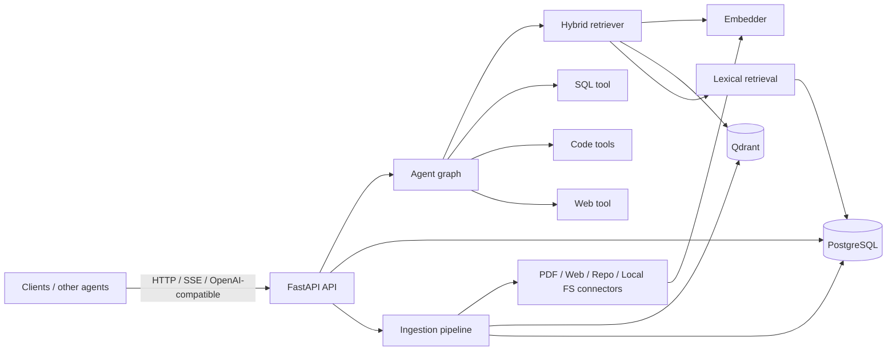
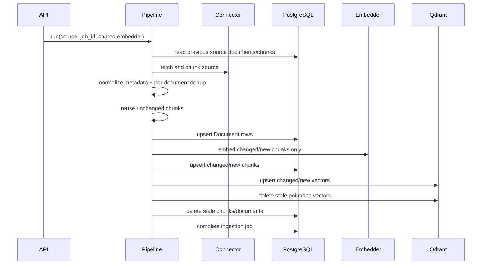

# Ragbot System Design

## 1. Purpose and boundaries

Ragbot is an agent-facing knowledge service. Its primary responsibility is to turn document/repository sources into tenant-scoped retrievable evidence, then combine lexical/vector retrieval with agent tools (SQL, code and web) to produce cited answers.

The current system is intentionally one API application plus supporting stores. It is not yet a durable distributed ingestion platform. Ingestion jobs are submitted through the API and currently execute in the API process executor; moving job ownership to a durable queue/worker is the next major reliability boundary.

## 2. Runtime architecture

### API layer

`services/api/app/api.py` owns HTTP lifecycle, auth dependency, `/chat`, admin health/readiness and router registration. `factory.py` is the composition root and must remain the only place that decides between in-memory and external persistence/vector implementations.

### Agent layer

`services/api/app/agent/graph.py` owns the agent loop: route -> tool action -> synthesize -> verify -> optional retry -> finalize. Event callbacks are transport-neutral. Callback closure is a hard invariant: every execution path, including exceptions, terminates the event stream.

### Retrieval layer

`Retriever` performs hybrid retrieval. Vector search runs in Qdrant (or the in-memory adapter). Lexical search calls the repository-native `search_chunks_fts` method when running with PostgreSQL, so production requests use the GIN FTS index instead of copying the whole chunk table into the API process. The in-memory lexical path is deliberately a simple scan for development/tests.

PostgreSQL FTS currently uses the `simple` text-search configuration. It works well for identifiers and whitespace-tokenized text, but it is not a Chinese-language segmentation engine. Chinese-heavy deployments should rely primarily on semantic vectors or introduce a dedicated CJK lexical strategy (for example PGroonga/zhparser/OpenSearch) before treating lexical recall as complete.

## 3. Ingestion data flow

### Replacement semantics

Re-ingestion is source-reconciliation, not repository-wide checksum deduplication. Identical text in two documents or tenants is valid independent evidence and must not disappear. Unchanged chunks retain their old chunk/point IDs and are not re-embedded when content and retrieval metadata are unchanged. New/changed chunks are written before stale data is removed. This preserves a last-good view if an embedding/vector write fails mid-job; a subsequent retry can reconcile partial writes.

This is not a distributed transaction across PostgreSQL and Qdrant. A process crash can still leave a partial new view. The reconciliation algorithm is designed to make retries self-healing, but a future production-grade ingestion subsystem should add durable job ownership plus an outbox/staging/version activation model if atomic source-version cutover is required.

## 4. Storage responsibilities

### PostgreSQL

PostgreSQL is authoritative for Sources, Documents, Chunks, ACL policies and ingestion-job metadata when `POSTGRES_DSN` is configured. It also serves production lexical search through the GIN FTS index. Ordered migrations are applied by `services.api.app.storage.migrations`, which records applied files in `schema_migrations`.

### Qdrant

Qdrant stores semantic vectors and retrieval payload metadata. `chunk_id` is the point ID and is also persisted as `qdrant_point_id`. The configured collection dimension must match the embedder dimension; Ragbot fails fast when an existing collection advertises a different vector size.

### In-memory implementations

The in-memory repository/vector store are for local development and deterministic tests. They are process-local state. They are not safe for multi-replica deployments.

## 5. Retrieval/security invariants

1. Ingestion and query retrieval use the same embedder implementation and vector dimension.
2. Source metadata is normalized centrally (`source_type`, tags, ACL hash, timestamps) before persistence/vector payload creation.
3. Tenant and ACL filters are applied before evidence reaches synthesis.
4. Source deletion purges its indexed documents/chunks/vectors before the Source is tombstoned.
5. Changing embedding model or dimension requires a compatible new collection/reindex operation; it is not an in-place configuration-only change.
6. `tenant_id` and `user_id` are currently trusted caller assertions. `RAGBOT_API_KEYS` are service-level credentials, not tenant-bound identities. Internet-facing multi-tenant SaaS requires an upstream identity/authz layer that binds credentials to tenant/user claims.

## 6. Availability and scaling

`/admin/health` is liveness only. `/admin/ready` initializes/checks the configured repository and vector store and returns 503 when dependencies are not ready. Kubernetes uses health for liveness and ready for readiness.

Helm defaults to one replica because empty Postgres/Qdrant configuration selects process-local implementations. The chart refuses multi-replica/autoscaled rendering unless shared Qdrant and PostgreSQL are configured.

## 7. API contract strategy

FastAPI/Pydantic is the single source of truth for HTTP OpenAPI. Use `/openapi.json`, `/docs`, or `scripts/export_openapi.py`. A handwritten OpenAPI snapshot was removed after it diverged from the runtime API. Shared agent/tool domain types remain in Python/TypeScript contracts and the Node client is typechecked in CI.

## 8. Current limitations and recommended next architecture steps

The highest-value next changes are:

1. **Durable ingestion workers** — replace `run_in_executor` with a real queue/worker ownership model, leases, retry policy, idempotency keys and shutdown recovery.
2. **Source-version activation/outbox** — stage a complete source version, then atomically switch the active version; use an outbox/reconciler for Qdrant side effects.
3. **Tenant-bound identity** — JWT/OIDC or gateway-issued identity, API-key ownership, RBAC and tenant-scoped admin endpoints.
4. **Retrieval observability/evaluation** — per-retriever recall/latency, citation faithfulness, golden datasets and release gates.
5. **CJK lexical retrieval** — choose a production Chinese tokenizer/search backend if Chinese keyword recall is a first-class requirement.
6. **Generated SDKs/contracts** — once the public API stabilizes, generate clients from runtime OpenAPI rather than maintaining duplicate DTOs by hand.
