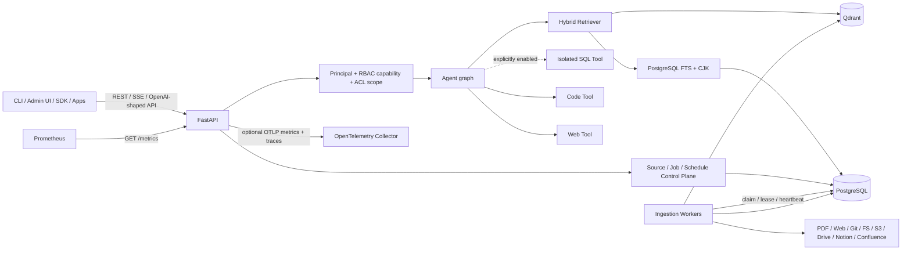
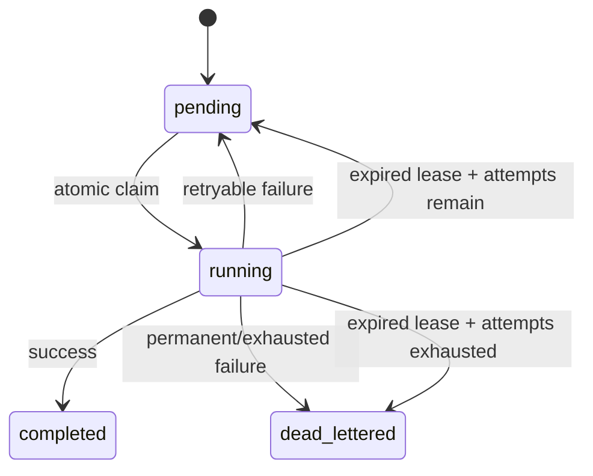

# Ragbot System Design

## 1. Purpose and production boundary

Ragbot is an agent-facing, multi-tenant knowledge service. It ingests PDF, Web, Git, local filesystem and cloud/SaaS Sources, produces tenant-scoped evidence, combines semantic and lexical retrieval, and synthesizes cited answers.

Production is split into:

- **API/query plane** — FastAPI, trusted principal/RBAC, Agent, retrieval, control plane and metrics endpoints;
- **durable ingestion worker plane** — PostgreSQL-backed Job claim/lease/heartbeat/retry/DLQ and Source scheduling;
- **PostgreSQL** — authoritative Sources, Jobs, schedules, documents/chunks, ACL and lexical state;
- **Qdrant** — semantic vector index;
- **Prometheus / OpenTelemetry** — replica-aggregatable production telemetry.

InMemoryRepo, InMemoryQdrant, HashEmbedder and inline ingestion are development/test fallbacks and are rejected by production composition.

## 2. Runtime architecture



The Agent loop remains repository-native:

```text
route → tool/retrieve → synthesize → verify → optional next action → finalize
```

## 3. Authorization model

Authentication establishes a trusted API-key principal containing tenant scope, stable user identity, groups, roles and optional `admin=true`.

Platform authorization is capability-based, with role inheritance:

| Capability | reader | operator | owner | global admin |
|---|:---:|:---:|:---:|:---:|
| `knowledge.query` | ✓ | ✓ | ✓ | ✓ |
| `catalog.read` | ✓ | ✓ | ✓ | ✓ |
| `feedback.write` | ✓ | ✓ | ✓ | ✓ |
| `source.create` |  | ✓ | ✓ | ✓ |
| `source.update` |  | ✓ | ✓ | ✓ |
| `source.sync` |  | ✓ | ✓ | ✓ |
| `ingestion.run` |  | ✓ | ✓ | ✓ |
| `ingestion.retry` |  | ✓ | ✓ | ✓ |
| `source.delete` |  |  | ✓ | ✓ |
| global admin/reconcile/metrics |  |  |  | ✓ |

Important separation:

- `owner` is a tenant-level destructive superset of `operator`;
- `admin=true` is a global operational identity and is not implied by owner;
- arbitrary role strings may still participate in document ACL policy matching, but only `reader/operator/owner` grant platform capabilities;
- production non-admin principals must have at least one recognized platform RBAC role.

Tenant and user claims from requests cannot expand the trusted principal. Retrieval ACL scope is computed before evidence reaches synthesis.

## 4. Retrieval architecture

```text
query
  ├─ embed → Qdrant semantic candidates
  └─ lexicalize → PostgreSQL FTS/CJK candidates
                       ↓
                      RRF
                       ↓
                optional reranker
                       ↓
                     top-k
```

Filters include tenant, ACL hash, Source type, document, tags, path/URL prefix and time range.

### Cache policy

Ragbot intentionally has **no supported runtime RetrievalCache** today. The old cache feature flags/admin surface were removed because the process-local cache was never connected to retrieval and could not be safely invalidated across API replicas and ingestion workers.

`services/api/app/cache/` retains small local cache primitives only for tests/experiments. They are not part of the runtime contract. A future production cache must be shared/distributed or otherwise generation-aware and must invalidate on Source/index generation changes before being placed on the retrieval path.

## 5. Durable ingestion and queue ownership

The API persists ingestion Jobs; dedicated workers atomically claim executable Jobs from PostgreSQL using the repository lease contract. Workers heartbeat leases, retry transient failures with bounded backoff, reclaim expired leases and dead-letter permanent/exhausted work.



There is exactly one queue architecture: repository/PostgreSQL durable Jobs. The unused legacy `services/worker/queue.py` abstraction has been removed.

The CLI treats `completed`, `failed` and `dead_lettered` as terminal states; DLQ failures therefore return immediately rather than timing out.

### Scheduled sync

Workers scan due Sources. Schedule-window Job IDs are deterministic and insertion is atomic, preventing duplicate scheduling when several workers race.

### Incremental SaaS refresh

Drive/Notion/Confluence compare remote metadata/version against the prior indexed snapshot. Unchanged content reuses existing chunks/vectors; changed/new content is fetched and embedded; remote deletions are pruned after successful replacement. This is metadata-first synchronization, not yet provider change-feed/cursor ingestion.

## 6. Source generation fencing

Each submitted Job freezes the current Source lifecycle generation in `stats.source_generation`. The worker and pipeline revalidate that generation before execution, before publish-sensitive writes and before completion.

```text
Job generation
    ↓
validate current Source
    ├─ stale → permanent failure / DLQ
    └─ current
         ↓
      connector
         ↓
      fence before write
         ↓
      PG + Qdrant publish/cleanup
         ↓
      final fence
```

Deletion is tombstone-first:

```text
Source status=deleted + new updated_at generation
        ↓
fence queued/running old Jobs
        ↓
purge PG/Qdrant knowledge
```

This prevents purge-then-writeback races. It is not a distributed PG/Qdrant transaction. Strict zero-partial-generation visibility would require staged generations plus an atomic active-generation pointer/outbox/reconciler.

## 7. Storage responsibilities

### PostgreSQL control plane

`POSTGRES_DSN` is internal Ragbot durable state: Sources, schedules, ingestion Jobs/leases/DLQ, documents/chunks, ACL and lexical retrieval metadata.

### Optional Agent SQL

Agent SQL is fail-closed and uses a distinct `RAGBOT_SQL_DSN`. Production rejects reuse of `POSTGRES_DSN` and requires an explicit schema allowlist. Application read-only checks are defense-in-depth; deployments should use a dedicated read-only DB identity, least-privilege views/grants and RLS or tenant-safe views where business SQL is multi-tenant.

### Qdrant

Qdrant owns semantic vector points/payloads. Embedder dimension and collection dimension are a single compatibility contract.

## 8. OpenAI-shaped compatibility

`POST /v1/chat/completions` preserves system messages, prior user/assistant history, last user turn as current retrieval query, `temperature`, `max_tokens`, non-stream responses and SSE transport.

Conversation history informs intent but is not treated as factual evidence. Current token usage is estimated and SSE sends chunks after the Agent final answer exists rather than provider-native token streaming.

## 9. Production observability

### Prometheus

`GET /metrics` is global-admin protected. Production Agent telemetry is emitted when events occur, not reconstructed from a process-local rolling history:

- `ragbot_agent_requests_total{route,confidence,cited}`;
- `ragbot_agent_request_duration_seconds{route}`;
- `ragbot_agent_retrieval_duration_seconds{route}`;
- `ragbot_agent_tool_calls_total{tool,status}`;
- `ragbot_agent_tool_duration_seconds{tool}`;
- `ragbot_agent_feedback_total{feedback}`;
- HTTP counters/latency;
- queue-state/oldest-pending/stale-lease gauges;
- Source-state gauges.

Prometheus naturally aggregates counters/histograms across API replicas. Queue/Source gauges are refreshed from shared durable repository state at scrape time.

### OpenTelemetry

Tracing remains available through `RAGBOT_TRACING_ENABLED`. Optional OTLP metrics use:

```dotenv
RAGBOT_OTEL_METRICS_ENABLED=true
OTEL_EXPORTER_OTLP_ENDPOINT=http://otel-collector:4317
```

Agent request/tool/latency/feedback metrics are emitted through the OTel SDK's periodic exporter.

### Process-local diagnostics

`MetricsCollector` still keeps bounded recent request history for admin request inspection and feedback correlation. `/admin/metrics` and `/admin/metrics/history` explicitly identify themselves as process-local diagnostics. They are not the production metrics backend and must not be aggregated as authoritative cluster statistics.

## 10. CLI ownership

There is one product CLI implementation:

```text
cli/rag.py
  ├─ rag ...
  └─ python -m cli.rag ...
```

`scripts/ragbot.py` is a separate bootstrap/deployment controller for setup/up/down/restart/status/logs and local/Docker path mapping. Product operations (`ask/search/ingest/import/doctor`) are delegated to `cli.rag`.

The old indirection/duplication files `cli/rag_impl.py` and `scripts/ragbot_impl.py` have been removed. Shared ingestion terminal-state logic remains in `cli/job_wait.py`.

## 11. Security invariants

1. Trusted principal resolution precedes tenant/user use.
2. Platform RBAC capability checks are separate from document ACL role matching.
3. Tenant/ACL filtering happens before synthesis.
4. Cloud connector secrets are deployment secret references, not inline Source config.
5. Local reads stay within configured roots; remote targets are SSRF/redirect constrained.
6. Agent SQL is disabled by default and cannot reuse the control-plane DB in production.
7. Source mutation/deletion fences old Jobs.
8. Embedding model/dimension changes require compatible reindex/cutover.
9. Destructive Source deletion requires owner/global-admin capability.
10. Production metrics are Prometheus/OTLP event metrics; bounded in-memory history is diagnostics only.

## 12. Deployment and recovery

Docker Compose provides a local durable topology. Helm provides API/worker Deployments, probes, rolling update configuration, optional API HPA and optional KEDA worker scaling from PostgreSQL queue depth.

PostgreSQL migrations run through the explicit migration runner. Disaster recovery covers PostgreSQL plus Qdrant snapshots and validation. Since PG/Qdrant are not one distributed transaction, strict point-in-time recovery requires quiesced ingestion or coordinated infrastructure snapshots.

## 13. Remaining architecture work

After this P2 convergence, the highest-value remaining work is:

1. atomic staged generation activation/outbox across PostgreSQL + Qdrant;
2. explicit per-principal capability policy for code/web Agent tools, matching SQL's fail-closed model;
3. DB-native tenancy standard for optional business SQL;
4. provider-native streaming and authoritative token usage;
5. durable/distributed feedback persistence instead of request-history affinity;
6. a generation-aware distributed retrieval cache only if measurements justify it;
7. generated SDKs from stable runtime OpenAPI.
